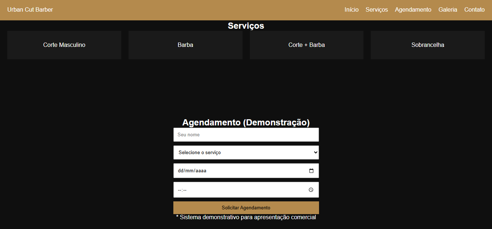
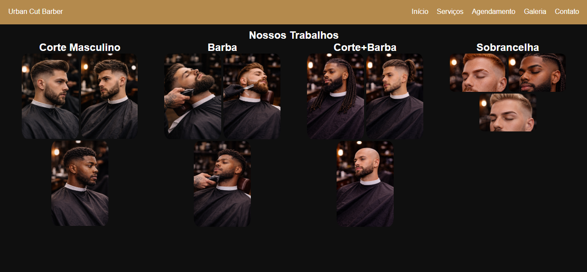
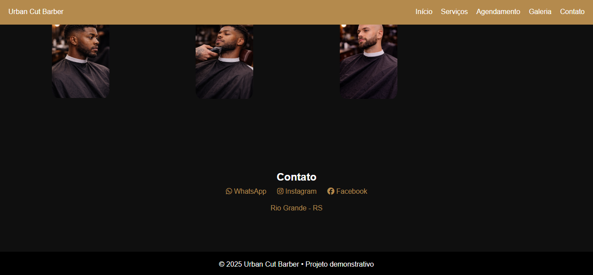

# 💈 Urban Cut Barber

Landing page desenvolvida como **projeto demonstrativo comercial** para barbearias, com foco em apresentação visual, serviços e simulação de agendamento online.

Este projeto faz parte do meu **portfólio de desenvolvedor front-end**, sendo um modelo que pode ser adaptado e vendido como site institucional para barbearias.

---

## 🔥 Funcionalidades

- Página inicial com chamada comercial
- Seção de serviços
- Sistema de agendamento **(modo demonstração)**
- Galeria de trabalhos (corte, barba e sobrancelha)
- Botões de contato e redes sociais
- Layout moderno com identidade **urbano + clássico**
- Design responsivo

> ⚠️ O sistema de agendamento é apenas ilustrativo, criado para apresentação comercial.

---

## 🛠️ Tecnologias Utilizadas

- HTML5  
- CSS3  
- JavaScript  
- Layout com Flexbox  
- Design responsivo  

---

## 🖼️ Preview do Projeto

### 🏠 Página Inicial

### ✂️ Serviços

### 📅 Agendamento & 🖼️ Galeria de Trabalhos (Demonstração)

### 📞 Contato

---

## 🚀 Objetivo do Projeto

- Demonstrar habilidades em **front-end**
- Criar um produto realista para uso comercial
- Servir como modelo para venda de sites institucionais
- Compor portfólio no GitHub e site pessoal

---

## 👨‍💻 Autor

**Lennon Oliveira**  
📍 Rio Grande - RS  

🔗 GitHub: https://github.com/Lennon-Adolfo  
🔗 LinkedIn: https://www.linkedin.com/in/lennon-adolfo-de-oliveira-6787b2276  

---

## 📄 Licença

Projeto de uso livre para fins educacionais e demonstrativos.

